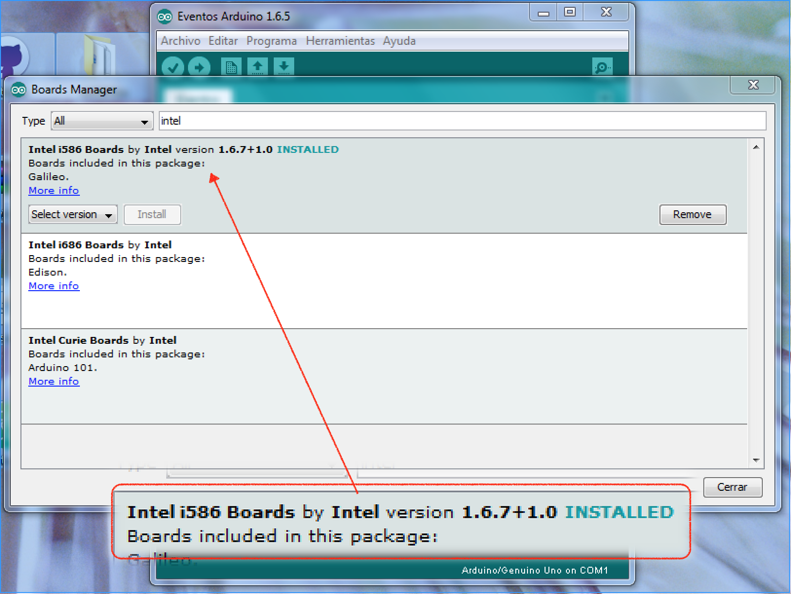

# Eliminación del timeout the EthernetClient.avialable() en Galileo

## Resumen
Galielo es un placa de Intel que corre Linux, sobre el cual, corre los sketchs de Arduino. La capa de traducción de Arduino a Linux, tiene un bug en la escucha de caracteres entrantes de una conexión TCP.

## Corrección del error

1. Verificar que el soporte de Galileo esté en la IDE oficial de Arduino.
    

2. Ubicar la carpeta con el código `EthernetClient.cpp`.

    * En Linux esta carpeta se encuentra en
        ~/.arduino15/packages/Intel/hardware/i586/1.6.7+1.0/libraries/Ethernet/src.
        Para abrirla utilizar el navegador de archivos y el menú ir a.

    * En Windows esta carpeta se encuentra en
        %userprofile%\\AppData\\Roaming\\Arduino15\\packages\\Intel\\hardware\\i586\\1.6.7+1.0\\libraries\\Ethernet\\src

        Para abrirla utilziar el menú Inicio y la opción ejecutar (en este caso abirá la carpeta).

    * En Mac está en
        ~/Library/Arduino15/packages/Intel/hardware/i586/1.6.7+1.0/libraries/Ethernet/src

        Desde Finder utilizar el menú Ir -> Ir a carpeta...

3. Abrir el archivo `EthernetClient.cpp` y ubicar el siguiente fragmento de código (observar línea 196):

```cpp
        int EthernetClient::available()
        {
            struct pollfd ufds;
            int ret = 0;
            extern int errno;
            int    timeout = 5000;  // milliseconds

            if (_sock == -1){
                return 0;
            }

            ufds.fd = _sock;
            ufds.events = POLLIN;
            ufds.revents = 0;

            ret = poll(&ufds, 1, timeout);
            if ( ret < 0 ){
                trace_error("%s error on poll errno %d", __func__, errno);
                return 0;
            }
            if( ret == 0)
                return 0;

```

4. Modificar el códig de manera que la variable milliseconds tenga el valor 0.

```
    int    timeout = 0;  // milliseconds, era 5000.
```
5. Guardar y volver a compilar el sketch
